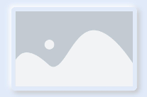

# Neumorphism_Card

Install using npm

```npm i hmos-neumorphism ```

# Note :

Add this css snippet when passing input or button through slot .

```css
button, input{
    width: 100%;
    height: 100%;
    background-color:transparent;
    text-color: black;
}
```

# Avatar


Import:
```html
<element name='neuavatar' src='../../../../../../node_modules/hmos-neumorphism/avatar/avatar.hml'></element>
```

Usage:
```html
<neuavatar icon="common/icons/user.png" width="100px" height="100px" border="50px"></neuavatar>
```

# Card



Import:
```html
<element name='neucard' src='../../../../../../node_modules/hmos-neumorphism/card/card.hml'></element>
```

Usage:
```html
<neucard width="300px" height="200px" border="10px" >
  <image src="common/placeholder.png" ></image>
</neucard>
```

# Reference:

<a href="https://neumorphism.io/">neumorphism.io</a>

<a href="https://ismail9k.github.io/neomorphism/">ismail9k.github.io/neomorphism</a>
